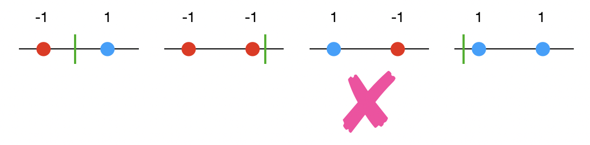
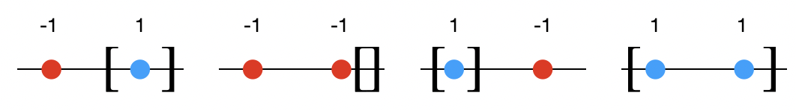
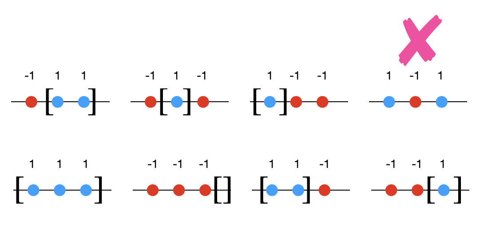
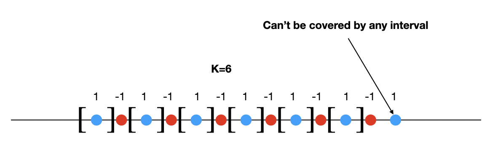
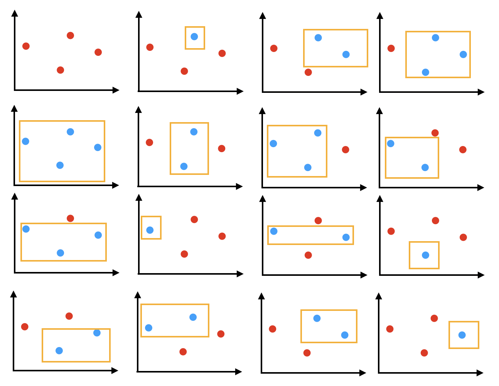
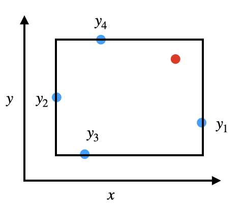

This is the first part of the <a href="/blog/vc-nn/">VC Dimension and Neural Networks</a> series. Basic definition and some examples of vc dimension of learning algorithms are explained here.

## 1. Definition

Let $S=\{x_1,x_2,\cdots,x_m\}$ be the set of m random points from $\mathbb{R}^d$ and $\mathscr{H}$ be a class of $\{-1,+1\}$ valued functions on $\mathbb{R}^d$ i.e $$\forall \\, h \in H, h:S \to \{0,1\}^m$$ One such example is $h_1(x_i)=1 \,\forall \, x_i \in S$. In the context of Machine Learning, $\mathscr{H}$ is the learning algorithm generally used for any classification task such as Logistic Regression etc. For each parameter $\theta$ in Logistic Regression we get $h(\theta;x) \in \mathscr{H}$.

$\textbf{Shattering:}$ $S$ is shattered by $\mathscr{H}$ when all labeling of $S$ (with 0 and 1) can be computed by $\mathscr{H}$ i.e for all labeling of $S$ denoted by $Y=\{0,1\}^m$, $\exists \\, h\in \mathscr{H}$ such that the $\sum_{i}|h(x_i)-y_i|=0$, where $y_i$ is the label of the ith point. Consider in Figure 1, $S$ is the set of three points, $\mathscr{H}=\{wx+b;w,b\in \mathbb{R}\}$, for every possible labels of $S$ (colors of $S$), there is a line which achieves the classification task. So $\mathscr{H}=\{wx+b;w,b\in \mathbb{R}\}$ shatters $S$ (from Figure 1).
<figure>
					
 

					<figcaption style= "text-align:center">Figure 1:  Shattering of 3 points in xy plane by lines. Red is for negative label and blue for positive label.
					</figcaption>
				</figure>

 $\textbf{Vapnik-Chervonenkis (VC) dimension}$ of a hypothesis space($\mathscr{H}$) is the cardinality of the largest $S$ such that $\mathscr{H}$ shatters $S$. If $VC(\mathscr{H})=n$, there there exists $n$ points which can be shattered by $\mathscr{H}$ but no set of $(n+1)$ points can be shattered.

## 2. VC-dimension of class of Thresholds in $\mathbb{R}$

Let $\mathscr{H}$ be the class of thresholds i.e $\forall h_a \in \mathscr{H}$, $$h_a(x)=\begin{cases} 
1 \, \text{if } x\geq a \\
-1 \, \text{if } x< a \\
\end{cases}$$
<figure>
					
 

					<figcaption style= "text-align:center">Figure 2: Sample size of 2 can't be shattered by the class of thresholds. Red is for negative label and blue for positive label. The green bar is the threshold. For third example, there is no hypothesis which can predict the two points.
					</figcaption>
				</figure>

When $|S|=1$, it can be shattered by $\mathscr{H}$. For $|S|=2$ it's impossible to shatter since we can't find a threshold for third example (Figure 2). So $VC(\mathscr{H})=1$

## 3. VC-dimension of class of Intervals in $\mathbb{R}$

Let $\mathscr{H}$ be the class of intervals i.e $\forall h([a,b];x) \in \mathscr{H}$,
$$h_a(x)=\begin{cases} 
1 \, \text{if } x\in [a,b] \\
-1 \, \text{if } x \notin [a,b] \\
\end{cases}$$
<figure>
					
 

					<figcaption style= "text-align:center">Figure 3:  Shattering of 2 points by the class of intervals. Points belonging to the intervals are predicted positive.
					</figcaption>
				</figure>

Sample of 2 points can be shattered by $\mathscr{H}$ by taking the positive label in an interval.

<figure>
					
 

					<figcaption style= "text-align:center">Figure 4:  Shattering of 3 points can't be possible by the class of intervals. For the fourth setup, there is no interval. 
					</figcaption>
				</figure>
				
But sample of 3 points can't be shattered by $\mathscr{H}$, since there is no hypothesis that can predict the example where the middle value is negative (Figure 3). So $VC(\mathscr{H})=2$.

 $\textbf{General Case:}$ For hypothesis class of k non-intersecting intervals ($\mathscr{H}^{k}$), VC dimension is $2k$ since every 2 points can be satisfied using one interval. But no sample with $2k+1$ points can be shattered since points with alternating positive and negative points can't be shattered by k intervals. (Figure 4)

$\textbf{Proof:}$ Let $S=\{x_1,x_2,\cdots,x_{2k+1} \}$. Label S such that $x_{2i+1}=1, x_{2i}=-1, \forall i=0,1,\cdots,k$. 
 Then there are $k+1$ positive examples. Since every positive example sits between two negative examples, every interval contains only one positive example. But there are only k intervals. So all the positive examples can't be covered. So $VC(\mathscr{H}^{k})=2k+1$. 

<figure>
					
 

					<figcaption style= "text-align:center">Figure 4:  For K=6, 2*6=12 points can be shattered by for 13 points, this configuration of labels can't be satisfied by the hypothesis space.
					</figcaption>
				</figure>

## 4. VC-dimension of class of axis-aligned rectangles in $\mathbb{R}^2$

Let $\mathscr{H}$ be the set of rectangles whose sides are parallel to the axes. Then it can shatter a set of 4 points. So $VC(\mathscr{H})\geq 4$ (Figure 5).

<figure>
					
 

					<figcaption style= "text-align:center">Figure 5:  Shattering of 4 points by axis-aligned rectangles. Red is for negative examples and blue is for positive examples.
					</figcaption>
				</figure>
A set of 5 points can't be shattered. Let $S_5=\{x_1,x_2,x_3,x_4,x_5 \}$ be a set of 5 points. Let $x_i[1], x_i[2]$ is the x-coordinate and y-coordinate of the point $x_i$ respectively.
$$ \begin{align} 
y_1=argmax_{x_i}(x_1[1],x_2[1],\cdots x_5[1])\\
y_2=argmin_{x_i}(x_1[1],x_2[1],\cdots x_5[1])\\
y_3=argmax_{x_i}(x_1[2],x_2[2],\cdots x_5[2])\\
y_4=argmin_{x_i}(x_1[2],x_2[2],\cdots x_5[2])\\
\end{align}$$
Then $\{y_1,y_2,y_3,y_4\} \subset S_5$. Label $y_i=1, \forall y_i$ and $S_5\setminus \{y_1,y_2,y_3,y_4\}$ as -1. Then there is no rectangle that can satisfy this configuration. Since $x_k \in S_5\setminus \{y_1,y_2,y_3,y_4\}$ must be inside the rectangle.
<figure>
					
 

					<figcaption style= "text-align:center">Figure 6:  Calculation of $y_1,y_2,y_3,y_4$.
					</figcaption>
				</figure>

So $VC(\mathscr{H})= 4$

## 5. VC-dimension of class of Line in $\mathbb{R}^2$

$\textbf{Theorem}:$ VC dimension of $\mathscr{H}=\{h;h(x)=sign(wx+b); w,b\in \mathbb{R}\}$ in $\mathbb{R}^2$ is 3 (Figure 1).

$\textbf{Proof}:$ Figure 1 shows a configuration of 3 points that can be shattered by $\mathscr{H}$. So, $VC(\mathscr{H}) \geq 3$. Now we have to prove that no set of 4 points can be shattered by $\mathscr{H}$.
  Consider the set $S_4=\{x_1,x_2,x_3,x_4\}$. Now if we create a convex hull of S and label the diagonal points as same class, then no line can't classify S. So $VC(\mathscr{H})= 4$. 

## 6. VC-dimension of class of hyperplane in $\mathbb{R}^d$

$\textbf{Theorem}:$ VC dimension of $\mathscr{H}=\{h;h(X)=sign(W^TX+b); W \in \mathbb{R}^d ,b\in \mathbb{R}\}$ in $\mathbb{R}^2$ is d.<a href="#proof" style="color:red">[1]</a>

$\textbf{Proof}:$ We will first prove the lower bound.
  
Let $S=\{x_1,x_2,x_3,\cdots,x_d\} \cup \{x_{d+1}=0\}$ and $\{x_1,x_2,x_3,\cdots,x_d\}$ is the <a href="https://en.wikipedia.org/wiki/Standard_basis">standard basis</a> of $\mathbb{R}^d$ $$\begin{align}
    x_1 = \begin{bmatrix}
           1 \\
           0 \\
           \vdots \\
            0
         \end{bmatrix}\quad
    x_2 = \begin{bmatrix}
           0 \\
           1 \\
           \vdots \\
            0
         \end{bmatrix}\cdots
     x_d = \begin{bmatrix}
           0 \\
           0 \\
           \vdots \\
            1
         \end{bmatrix}
  \end{align}$$
Let $Y=\{y_1,y_2,\cdots,y_d \}$ is a class label for S with $y_i\in \{-1,+1\}\, \forall \, i$,
then $$h(X)=sign(\sum_i [x_i;1]\hat{W}),\hat{W}=[W;b]$$ can classify S. $$\begin{align}
    [x_i;1] = \begin{bmatrix}
           0\\
           0 \\
           \vdots \\
           i\\
           \vdots\\
            0\\
            1
         \end{bmatrix}
         \end{align}$$
 
This is because the augmented set $\{[x_1;1],[x_2;1],\cdots, [x_d+1,1]\}$ is linearly independent and since its cardinality is $d+1$, it's a basis of $\mathbb{R}^{d+1}$. To prove that it's linearly independent, consider $\sum_i^{d+1} [x_i;1]\alpha_i =0$.
$$
\begin{bmatrix}
           1 & 0 &\cdots 1\\
           0 & 1 &\cdots 1\\
           \vdots \\
            0& 0 &\cdots 1
         \end{bmatrix}
         \begin{bmatrix}
           \alpha_1 \\
           \alpha_2 \\
           \vdots \\
           \alpha_{d+1}
         \end{bmatrix}=
         \begin{bmatrix}
           0 \\
           0 \\
           \vdots \\
           0
         \end{bmatrix}
$$
Then $\alpha_1=0,\alpha_2=0,\cdots, \alpha_{d+1}=0$. So the augmented set is linearly independent and a basis of $\mathbb{R}^{d+1}$. So $$h(X):sign(\sum_i [x_i;1]\hat{W})=Y$$ will always have a closed form solution. (One trick is to solve $[X;1]\hat{W}=Y \implies \hat{W}=[X;1]^{-1}Y, [X;1]=[[x_1;1] \,[x_2;1]\cdots \,[x_{d+1};1] $).
 
Then there exists a set of $d+1$ points that $\mathscr{H}$ can shatter. So $VC(\mathscr{H})\geq d+1$
 

 
Now we will try to prove the upper bound ($VC(\mathscr{H})\leq d+1$).
 
Let $S^{'}=\{x_1,x_2,\cdots, x_{d+2}\}$ be the set of $d+2$ points that $\mathscr{H}$ can shatter. Then we will get $W_i$ for every $2^{d+1}$ possible labeling such that $h(X)=sign([X;1]W_i)$. Let $W=[W_1^T \, W_2^T \, W_3^T \cdots \, W_{2^{d+2}}^T]$ be the vector containing all the $2^{d+2}$ weights.
$$\begin{align}
    h(X) = \begin{bmatrix}
           [x_1;1] \\
           [x_2;1] \\
           \vdots \\
           [x_{d+2};1]
         \end{bmatrix}
         \begin{bmatrix}
           W_1^T W_2^T W_3^T W_4^T \cdots W_{2^{d+2}}^T\\
         \end{bmatrix}\\
       h(X)= \begin{bmatrix}
          W_1^T[x_1;1] & W_2^T[x_1;1] & \cdots \cdots & W_{2^{d+2}}^T[x_1;1] \\
          W_1^T[x_2;1] & W_1^T[x_2;1] & \cdots \cdots  & W_{2^{d+2}}^T[x_2;1] \\
          \vdots & \vdots & \ddots & \vdots\\
          \vdots & \vdots & \quad \quad \quad \quad \quad\ddots & \vdots\\
          W_1^T[x_{d+2};1] & W_1^T[x_{d+2};1] & \cdots \cdots  & W_{2^{d+2}}^T[x_{d+2};1]
         \end{bmatrix}
         \end{align}$$

Then the row vectors of $h(X)$ are linearly independent. If $a^Th(X)=0$, then 
$$
\begin{align}
\begin{bmatrix}
a_1 & a_2 & \cdots & a_{d+2}
\end{bmatrix}_{(1,d+2)}
\begin{bmatrix}
           W_1^T[x_1;1] & W_2^T[x_1;1] & \cdots \cdots & W_{2^{d+2}}^T[x_1;1] \\
          W_1^T[x_2;1] & W_1^T[x_2;1] & \cdots \cdots  & W_{2^{d+2}}^T[x_2;1] \\
          \vdots & \vdots & \ddots & \vdots\\
          \vdots & \vdots & \quad \quad \quad \quad \quad\ddots & \vdots\\
          W_1^T[x_{d+2};1] & W_1^T[x_{d+2};1] & \cdots \cdots  & W_{2^{d+2}}^T[x_{d+2};1]
         \end{bmatrix}_{(d+2,2^{d+2})}
         \end{align}$$
$$\begin{align}
       = \begin{bmatrix}
         \sum_{i=1}^{d+2}a_iW_1^T[X_i;1] \\
          \sum_{i=1}^{d+2}a_iW_2^T[X_i;1] \\
          \vdots\\
           \sum_{i=1}^{d+2}a_{i}W_{d+2}^T[X_i;1]
         \end{bmatrix}
\end{align}
$$
Then the kth entry is $\sum_{i=1}^{d+2}a_iW_k^T[X_i;1]$. Since we assumed that $\mathscr{H}$ can shatter $S$ then $\exists \, k^{'}$ such that $sign(W_{k^{'}}^T[X_i;1])=sign(a_i) \, \forall \, i$. So if $a_i\neq 0$ for some $i$, then $\sum_{i=1}^{d+2}a_iW_{k^{'}}^T[X_i;1] > 0$, which is a contradiction, so $a_i=0 \, \forall \, i$. So $rank(h(X))=d+2$.
 
Since $h(X)=[X;1]W$, $rank(h(X))=min(rank([X;1],rank(W))) \implies rank(h(X)) \leq d+1$ since $[x_i;1] \in \mathbb{R^{d+1}}$ and the a set of $d+2$ vectors in $\mathbb{R}^{d+1}$ is linearly dependent, so $rank([X;1]) \leq d+1$.
 
So it's a contradiction as we proved that $rank(h(X))=d+2$. Then our initial assumption that $S$ can be shattered by $\mathscr{H}$ is wrong.

The upper bound can also be proven using <a href="/blog/vc-nn/theorems/#2-theorem-1---radons-theorem">Radon's Theorem</a> which states that any set $S \subset R^{d}$ with $|S|=d+2$ can be partitioned into two disjoint subsets $S_1$ and $S_2$ whose convex hulls intersect which means it can't be separated by a hyperplane for all possible labeling, hence it can't be shattered by $\mathscr{H}$.

So $VC(\mathscr{H})=d+1$.

## 7. Bibliography

<ol>
<li>
    
<a href="https://mlweb.loria.fr/book/en/VCdimhyperplane.html"><i>https://mlweb.loria.fr/book/en/VCdimhyperplane.html</i></a>

 </li>
 
 </ol>

