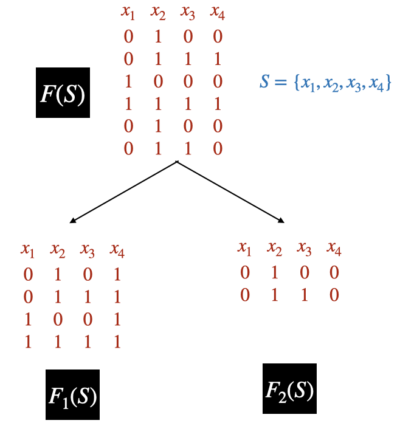

This is the second part of the <a href="/blog/vc-nn/">VC Dimension and Neural Networks</a> series. This part lists important theorems with proofs and explanations. To know the basics of VC dimension, check <a href="/blog/vc-nn/introduction">Part 1 - VC Dimension - Definition and Examples</a>.

## 1. Definitions

	
$\textbf{Dichotomy}:$ A dichotomy of $S=\{x_1,x_2,\cdots,x_m\}$ induced by $h \in \mathscr{H}$ is a partition of S into two disjoint sets $S_1$ and $S_2$ such that $$h(x_i)=\begin{cases}
       1 \, \text{if} \, x_i \in S_1 \\
      -1 \, \text{if} \, x_i \in S_2\\
     \end{cases}$$

 
Let $\mathscr{H}(S)$ be the set of all labelings or dichotomies that can be realized by $\mathscr{H}$. $$\mathscr{H}(S)=\{ \{ h(x_1),h(x_2),\cdots h(x_m) \}; h \in \mathscr{H} \}$$ If $|\mathscr{H}(S)|=2^{|S|}$, then $S$ is shattered by $\mathscr{H}$. 
 
Since $S$ is chosen randomly, we define $\textbf{Growth Function}$ <a href="#lecture1">[1]</a> $$\mathscr{H}[m]=max\{|\mathscr{H}(S)|; |S|=m ; S \subset R^m \}$$
 

## 2. Theorem 1 - Radon's Theorem

$\textbf{Theorem 1 (Radon's Theorem):}$ <i>For every set $S \subset {R}^{d}$ with $|S|=d+2$, $S$ can be divided into two disjoint sets whose convex hulls intersect.</i>

$\textbf{Proof:}$ Let $S=\{x_1,x_2,\cdots,x_{d+2}\} \subset R^{d}$. Then $S$ is a linearly dependent set. Let $S_{aug}=\{[x_1;1],[x_2,;1]\cdots,[x_{d+2};1]\} \subset R^{d+1}$ be the augmented set and it's also a dependent set. Then the equation $$\sum_{i=1}^{d+2}a_i[x_i;1]=0$$ has non-zero solution (not all $a_i=0$) and $\sum_{i=1}^{d+2}a_i=0$.
Let I be the convex hull of $\{x_i:a_i>0\}$ and J be the convex hull of $\{x_i:a_i\leq 0\}$.
$\{x_i:a_i>0\} \cap \{x_i:a_i\leq 0\} =\phi$. 
 
Let $A=\sum_{i:x_i\in I}a_i=-\sum_{j:x_j\in J}a_j$.
 
 Then $\frac{1}{A}\sum_{i=1}^{d+2}a_ix_i=0 \implies \sum_{i:x_i\in I}\frac{a_j}{A}x_j=-\sum_{j:x_j\in J}\frac{a_j}{A}x_j$ 
  So $p=\sum_{i:x_i\in I}\frac{a_j}{A}x_j=-\sum_{j:x_j\in J}\frac{a_j}{A}x_j$  
  So $p \in I \text{ and } p \in J$. 
  So, S can be divided into two disjoint sets whose convex hulls intersect.  

## 3. Theorem 2 - $VC(\mathscr{H}) \leq log_2(|\mathscr{H}|)$

$\textbf{Theorem 2:}$ <i>Let $\mathscr{H}$ be a set of binary-valued functions and $\mathscr{H}$ is finite. Then $VC(\mathscr{H}) \leq log_2(|\mathscr{H}|)$.
</i>

 
$\textbf{Proof:}$ Let $VC(\mathscr{H})=d$, then there exists a set of $d$ points such that for every $2^d$ possible labelings, $\exists \, h \in \mathscr{H}$ which can classify the points. Then the cardinality of $\mathscr{H}$ must be greater than $2^d$. 
 
So $|\mathscr{H}|\geq 2^d \implies d \leq log_2(\mathscr{H}) \implies VC(\mathscr{H}) \leq log_2(\mathscr{H})$.;
 

## 4. Theorem 3 - Sauer's Lemma

$\textbf{Theorem 2:}$ <i> Let $VC(\mathscr{H})=d$ and $S$ be a set of $m$ points. Then $$\mathscr{H}[m] \leq \Phi_{d}(m)=\sum\limits_{i=0}^{d} {m\choose i}$$ </i>

  $\textbf{Proof:}$ We will prove it by induction. 
  <strong> Base Case: </strong>For the base case, we have to prove for (1) $d=0$ and arbitrary $m$ and (2) $m=0$ and arbitrary $d$. When $VC(\mathscr{H})=d=0$, it means that no set of points can be shattered, so points can only be labeled one way. So, $\mathscr{H}[m] = 1 \leq \Phi_{d}(m)$. When $m=0$ and $d$ is arbitrary, we can label $0$ points at most $1$ way.   
 
 
<strong> Inductive Step: </strong> Let us assume that $\forall m^{'} < m,d^{'} < d$, this statement is true. Let $S=\{x_1,x_2,\cdots,x_m\}$ and $VC(\mathscr{H})=d$. Let $F$ be the set of functions defined only over $S$ such that $\mathscr{H}(S)=F(S)=F$. Then for any set $S^{'} \subset S$ that is shattered by $F$ can be shattered by $\mathscr{H}$. So $VC(F)\leq VC(\mathscr{H})=d$.
 
We now create two disjoint subsets of $F$. For every possible labelings of $\{x_1,x_2,\cdots,x_{m-1}\}$ in F $$F_1=\{ \{f(x_1),f(x_2),\cdots, f(x_{m-1}), 1 \}; f \in F \}$$ $$F_2=F\setminus F_1=\{ \{f(x_1),f(x_2),\cdots, f(x_{m-1}), 0 \}; f \in F \}$$
Then $\forall f_2 \in F_2$, $\exists \, f_1 \in F_1$, such that $f_1(x_i)=f_2(x_i)$, $\forall i=1,2,\cdots, m-1$ and $f_1(x_m)=1, f_2(x_m)=0$.
$$|\mathscr{H}(S)|=|F(S)|=|F_1(S)|+|F_2(S)|$$
<figure>
					
 

					<figcaption style= "text-align:center">Figure 1:  Let $S=\{x_1,x_2,x_3,x_4\}$. The $F_1(S)$ consists of all possible labelings for $\{x_1,x_2,x_3\} \in F(S)$ and $x_4=1$ and if two hypotheses in $F$ label $\{x_1,x_2,x_3\}$ the same way, then the one which labels $x_4$ as $0$ will be in $F_2(S)$.
					</figcaption>
				</figure>
 
Consider the case of $F_1$. It's obvious that $VC(F_1) \leq VC(F) \leq d$. Now, $|F_1(S)|=|F_1(S \setminus \{x_m\})|$, since every labeling in $F_1(S)$ which is of the form $\{f(x_1),f(x_2),f(x_3), \cdots, f(x_{m-1}),1 \}$, $$\{f(x_1),f(x_2),f(x_3), \cdots, f(x_{m-1}) \} \in F_1(S\setminus \{x_m\})$$ So $|F_1(S)| \leq |F_1(S\setminus \{x_m\})|$.
 
 
Let $\{f^{'}(x_1),f^{'}(x_2),f^{'}(x_3), \cdots, f^{'}(x_{m-1}) \} \in F_1(S\setminus \{x_m\})$, then 
$$\{f^{'}(x_1),f^{'}(x_2),f^{'}(x_3), \cdots, f^{'}(x_{m-1}),1 \} \in F_1(S)$$ So, $|F_1(S\setminus \{x_m\})| \leq |F_1(S)| $.
Then $$|F_1(S)| = |F_1(S\setminus \{x_m\})| \leq \Phi_{d}(m-1)=\sum\limits_{i=0}^{d} {m-1\choose i}$$
 
For $F_2$ $$|F_2(S)|=|F_2(S\setminus\{x_m\})|$$
If $T$ is shattered by $F_2$, then $T\cup \{x_m\}$ must be shattered by $F$ since $\forall f_2 \in F_2, \exists \, f_1 \in F_1$ such that $f_1(x_i)=f_2(x_i)$, $\forall \, i=1,2,\cdots, m-1$ and $f_1(x_m)=1, f_2(x_m)=0$ (In Figure 1, $F_2$ shatters $\{x_3\}$ then $F$ shatters $\{x_3,x_4\}$).$ VC(F_2) \leq VC(F)-1 \leq d-1$.
$$ |F_2(S)| \leq \Phi_{d-1}(m-1)=\sum\limits_{i=0}^{d-1} {m-1\choose i}$$

 So, $|\mathscr{H}(S)|=|F(S)|=|F_1(S)|+|F_2(S)| \leq \sum\limits_{i=0}^{d} {m-1\choose i} + \sum\limits_{i=0}^{d-1} {m-1\choose i}$ 
 
$\implies |\mathscr{H}(S)| \leq \sum\limits_{i=0}^{d} {m-1\choose i} + \sum\limits_{i=0}^{d-1} {m-1\choose i}$ 
 
$\implies |\mathscr{H}(S)| \leq {m\choose 0} + \sum\limits_{i=1}^{d} {m-1\choose i} + \sum\limits_{i=1}^{d} {m-1\choose i-1}$ (Since ${m\choose 0}={m-1\choose 0}$)
 
 
$\implies |\mathscr{H}(S)| \leq {m\choose 0} + \sum\limits_{i=1}^{d} {m\choose i}$ (Since ${m-1\choose k}+{m-1\choose k-1}={m\choose k}$, which comes from $(1+X)^m=(1+X)^{m-1}(1+X)$. See <a href="https://en.wikipedia.org/wiki/Pascal%27s_triangle">here</a> for more information.)
 
 
$\implies |\mathscr{H}(S)| \leq \Phi_{d}(m)= \sum\limits_{i=0}^{d} {m\choose i}$
 
So it proves the theorem.

### Corollary

$\textbf{Corollary 3.1:}$ <i> $\Phi_{d}(m)<2^m$ if $d < m$. </i>

  $\textbf{Proof:}$ We know, $\Phi_{d}(m)=\sum\limits_{i=0}^{d} {m\choose i}$ and $$ (1+x)^m=\sum\limits_{i=0}^{m} {m\choose i}1^ix^{m-i}$$ 
Take x=1, then
$$2^m=\sum\limits_{i=0}^{m}{m\choose i}$$
So $\Phi_{d}(m)=\sum\limits_{i=0}^{d} {m\choose i}< \sum\limits_{i=0}^{m} {m\choose i}=2^m$ (if $d < m$).

## Bibliography

<ol>
<li>
    
<a href="http://www.cs.cmu.edu/%7Eninamf/ML11/lect0922.pdf"><i>8803 Machine Learning Theory</i></a>

 </li>
 
 </ol>
