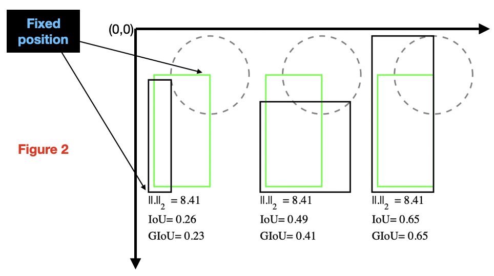

## 1. Why is $l_{n}$ not a good choice?

<p>
Bounding Box Regression is the most important task in Object Detection.
In conventional object detection networks, a $l_{n}$ norm is used during
training to evaluate the performance of the detector with
the IoU (Intersection over Union) metric: $$IoU=\frac{|B_{G}\cap B_{P}|}{|B_{G} \cup B_{P}|}$$
where $B_{g}$ and $B_{d}$ are the ground and predicted bounding boxes, respectively.
However there is no correlation between minimizing $l_{n}$ norm and improving the
loss associated to the IoU metric [<a href="#giou" style="color:red">1</a>], $$L_{IoU}=1-IoU(B_{g},B_{d})$$.
</p>
<figure>
<center> </center>
<figcaption>Figure 1: Three cases where the $l_{2}$-norm distance between the
representations of two rectangular bounding boxes, each given by the concatenation of the
coordinates of
two opposite corners, has the same value but IoU and GIoU metrics have very different values [<a href="#giou" style="color:red">1</a>]
</figcaption>
</figure>
<p>
In Figure 1, the predicted bounding box
(black rectangle) and ground truth box (green rectangle) are
each represented by their top-left and bottom-right corners
(pointed by arrows), and whose the Cartesian coordinates are
denoted as $(x_{1} , y_{1} , x_{2} , y_{2})$ and $(x_{1}' ,
y_{1}' , x_{2}' , y_{2}')$, respectively. For simplicity,
let us assume that the distance, e.g. $l_{2}-norm$,
between one of the corners of two boxes is fixed. Now, if the
second corner lies on a circle with fixed radius centered on the
ground truth box, then the $l_{2}$ loss between the ground truth
box and the predicted bounding box is the same although their IoU
values can be different depending upon the positions of top-right
and bottom-left corners. So, using IOU-loss should be the best
option since we will then minimize the evaluating metric.
</p>

## 2. IoU Loss [<a href="#ubox" style="color:red">4</a>]

<p>
Generally, for two finite sample sets A and B, their IoU is defined as the intersection $(A \cap B)$
divided by the union $(A \cup B)$ of A and B.
</p>
<p style="text-align: center">
$IoU(A,B)=\frac{|A \cap B|}{|A \cup B|}=\frac{|A \cap B|}{|A|+|B|-|A \cup B|}$
</p>
<p>
For bounding box-level object detection,
the target object is usually represented by a minimum Bbox
rectangle in the 2D image. Base on this representation, the
IoU computation between the ground bounding box $B_{g}=(x_{1} , y_{1} , x_{2} , y_{2} )$ and
the predicted bounding box $B_{d}=(x_{1}^{\prime} , y_{1}^{\prime} , x_{2}^{\prime} ,
y_{2}^{\prime} )$ is defined as:-
</p>
<p style="text-align: center">
$ IoU(A,B)=\frac{\text{Area of overlap between $B_{g}$ and $B_{d}$}}{\text{Area of union of $B_{g}$
and $B_{d}$}}=$
</p>
<p style="text-align: center">
$\frac{(max(x_{1},x_{1}^{\prime})-min(x_{2},x_{2}^{\prime}))\times
(max(y_{1},y_{1}^{\prime})-min(y_{2},y_{2}^{\prime}))}{(x_{2}-x_{1})
(y_{2}-y_{1})+(x_{2}^{\prime}-x_{1}^{\prime})
(y_{2}^{\prime}-y_{1}^{\prime})-(max(x_{1},x_{1}^{\prime})-min(x_{2},x_{2}^{\prime}))
(max(y_{1},y_{1}^{\prime})-min(y_{2},y_{2}^{\prime}))}$
</p>
<p>Usually, objects are labeled with axis-aligned BBoxes in the
ROI dataset. By taking this kind of labels as ground truth,
the predicted BBoxes are also axis-aligned rectangles.
For this case, the IoU computation is very easy.</p>

### *A. Loss Function*

<p>
The IOU loss function[<a href="#ubox" style="color:red">4</a>] for the ground bounding box $B_{g}=(x_{1} , y_{1} , x_{2} , y_{2} )$ and
the predicted bounding box $B_{d}=(x_{1}^{\prime} , y_{1}^{\prime} , x_{2}^{\prime} , y_{2}^{\prime}
)$ is defined as
</p>
<p style="text-align: center">
$L_{IoU}=1-IoU(B_{g},B_{d})$
</p>
<p>We have to prove that $L_{IoU}$ is a metric</p>
<p>
<ol>
<li>
	Since $0\leq IoU \leq 1, 0\leq L_{IoU} \leq 1$.
	So $L_{IoU}$ is non-negative. $L_{IoU}=0 \text{ when }
	IoU(A,B)=1 \implies$ $A$ and $B$ are the same rectangle.
</li>
<li>
	$IoU(A,B)=IoU(B,A) \implies L_{IoU}(A,B)=L_{IoU}(B,A)$.
	So $L_{IoU}$ is symmetric.
</li>
<li>
	$L_{IoU}$ satisfies triangle inequality.[<a href="#teq" style="color:red">5</a>]
</li>
</ol>
So $L_{IoU}$ is a metric.
</p>

### *B. Differentiability of IoU Loss*

<p>IOU loss is differentiable and can be backpropagated.
Let $B_{g}=\{x_{1},y_{1},x_{2},y_{2}\}$ be the ground truth and
$B_{d}=\{x_{1}^{\prime} , y_{1}^{\prime} , x_{2}^{\prime} , y_{2}^{\prime}\}$
be the predicted bounding box.</p>
<p style="text-align: left;margin-left:2em">
$X= \text{Area of } B_{g}=(x_{2}-x_{1}) \times (y_{2}-y_{1})$
<br>$X^{\prime}= \text{Area of } B_{d}=(x_{2}^{\prime}-
x_{1}^{\prime})\times (y_{2}^{\prime}-y_{1}^{\prime})$
<br>$I=(max(x_{1},x_{1}^{\prime})-min(x_{2},x_{2}^{\prime}))
\times (max(y_{1},y_{1}^{\prime})-min(y_{2},y_{2}^{\prime}))$
<br> $L_{IoU}=1-\frac{I}{X+X^{\prime}-I}=1-\frac{I}{U},
\text{where } U=X+X^{\prime}-I$
<br> $\frac{\partial L}{\partial x^{\prime}}=\frac{I(\Delta_{x^{\prime}}X-
\Delta_{x^{\prime}}I)-U\Delta_{x^{\prime}}I}{U^{2}}$
<br>$\frac{\partial X}{\partial x_{1}^{\prime}}=-
(y_{2}^{\prime}-y_{1}^{\prime}), \frac{\partial X}{\partial x_{2}^
{\prime}}=(y_{2}^{\prime}-y_{1}^{\prime}),\frac{\partial X}
{\partial y_{2}^{\prime}}=(x_{2}^{\prime}-x_{1}^{\prime}),
\frac{\partial X}{\partial y_{1}^{\prime}}=-(x_{2}^{\prime}-x_{1}^
{\prime})$
</p>
<p style="text-align: center">
<br> $\frac{\partial I}{\partial x_{1}^{\prime}}=
\begin{cases}
(max(y_{1},y_{1}^{\prime})-min(y_{2},y_{2}^{\prime})) & \text{ if } x_{1}^{\prime}>x_{1}\\
0 & { Otherwise } \end{cases}$
<br> $\frac{\partial I}{\partial x_{2}^{\prime}}=
\begin{cases}
-(max(y_{1},y_{1}^{\prime})-min(y_{2},y_{2}^{\prime})) & \text{ if } x_{2}>x_{2}^{\prime}\\
0 & { Otherwise } \end{cases} $
<br> $\frac{\partial I}{\partial y_{1}^{\prime}}=
\begin{cases}
(max(x_{1},x_{1}^{\prime})-min(x_{2},x_{2}^{\prime})) & \text{ if } y_{1}^{\prime}>y_{1}\\
0 & { Otherwise }
\end{cases}$
<br> $\frac{\partial I}{\partial y_{2}^{\prime}}=
\begin{cases}
-(max(x_{1},x_{1}^{\prime})-min(x_{2},x_{2}^{\prime})) & \text{ if } y_{2}>y_{2}^{\prime}\\
0 & { Otherwise }
\end{cases}$
</p>
<p>
So $L_{IoU}$ can be directly used as the objective function to
optimize. It is therefore preferable to use IoU as the objective
function for 2D object detection tasks. Given the choice between
optimizing a metric itself vs.a surrogate loss function,
the optimal choice is the metric itself.
</p>


## 3. GIoU Loss

However, IOU has two major issues as a metric and loss function.

- If two boxes don't overlap, then their IoU is zero, which doesn't give any indication about the proximity of the two boxes.
- In case of non-overlapping boxes, since their Iou is zero, the gradient is also zero. So $L_{IoU}$ can't be optimized.
Generalized IoU (GIoU) addresses these weaknesses of IoU.

### *A. Loss Function*

The Loss function for the Generalized IoU is defined as follows:-

<p style="margin-left:2em">
Let A and B be two boxes.
<br> Let C be the smallest enclosing box.
<br> $IoU=\frac{|A\cap B|}{|A \cup B|}$.
<br> $GIoU=IoU-\frac{|C\setminus (A\cup B)|}{|C|}$.
<br> $L_{GIoU}=1-GIoU$.
</p>
<p> Some of the properties of GIoU[<a href="#giou" style="color:red">1</a>]:-
</p>

- Similar to $L_{IoU}, L_{GIoU}$ is also non-negative, symmetric and satisfies triangle inequality. So $L_{GIoU}$ is a metric.

- GIoU is a lower bound for IoU. $\forall A,B, GIoU(A,B)\leq IoU(A,B)$ and this lower bound becomes tighter when A and B have a stronger shape
similarity <i>i.e</i> $\lim_{A \to B} GIoU(A,B)=IoU(A,B)$.

- $0\leq IoU(A,B)\leq 1 \implies -1\leq GIoU(A,B)\leq 1$.

- $GIoU=1 \text{ when } |A\cap B|=|A\cup B|$ <i>i.e</i> when A and B completely overlaps.

- GIoU tends to -1 as the ratio between occupying
regions $|A\cup B|$ and the smallest enclosing box
C goes to zero, i.e $\lim_{\frac{|A\cup B|}{C} \to 0}
GIoU(A,B)=-1 $

- $L_{GIoU}$ is differentiable.

- When IoU=0, i.e boxes don't overlap, $L_{GIoU}=2-\frac{|A\cup B|}{|C|}$.
By minimizing $L_{GIoU}$, we are maximizing $\frac{|A\cup B|}{|C|}$
($0\leq \frac{|A\cup B|}{|C|} \leq 1$) which means we are
maximizing the region of union $|A\cup B|$ and minimizing the
enclosing box area $|C|$, which will be possible if the
predicted box goes to the ground truth box.


## 4. DIoU and CIoU Loss

<p>IoU loss works only for overlapping boxes and the
problem of gradient-vaninshing in case of non-overlapping boxes
had been solved by GIoU Loss but GIoU loss has several limitations.</p>
<ul>
<li>
Generalized IoU tends to increase the size of the predicted
bounding box to cover the target ground truth box. From Figure 2,
we can see that when the predicted bounding box covers the
ground truth box then $ L_{GIoU}=L_{IoU}$ (Since C=$max(A,B)\implies
C\setminus(A\cup B)=\Phi$).
</li>
<li>
$L_{GIoU}$ converges slowly.
</li>
</ul>
<figure>
<center> </center>
<figcaption class="figure-caption text-center">Figure 2: The
<span style="color:greenyellow">green</span>,
<span style="color:rgb(117, 111, 111)">black</span>,
<span style="color:cyan">blue</span>,
<span style="color:red">red</span> represents the ground truth
box, the anchor box, the predicted box at ith step
when GIoU loss is used,the predicted box at ith step
when DIoU loss is used respectively. GIoU tends to extend the box
to cover the [<a href="#diou" style="color:red">2</a>]
</figcaption>
</figure>

### *A. Distance IoU (DIoU) Loss Function[<a href="#diou" style="color:red">2</a>]*

<p>
Generally IoU-based loss functions can be defined as
</p>

$$L=1-IoU+R(B,B^{gt})$$

<p>
where $R(B,B^{gt})$ is a penalty term and $B_{gt}$ and $B$ are the
ground truth box and predicted box.
</p>
<p>
DIoU minimizes the normalized distance between the centre point
of the two bounding boxes. The penalty term is
</p>

$$R_{DIoU}=\frac{\rho^{2}(b,b_{gt})}{c^{2}}$$

<p>
where $b$ and $b_{gt}$ denote the central points of $B$ and $B_{gt}$,
and $c$ is the diagonal length of the smallest enclosing box.
and $\rho$ is the euclidean distance. So,
</p>

$$L_{DIoU}=1-IoU+\frac{\rho^{2}(b,b_{gt})}{c^{2}}$$

<ul>
<li>
$L_{DIoU}$ is scale invariant.
</li>
<li>$L_{IoU}=L_{GIoU}=L_{DIoU}=0$ when two boxes are same.</li>
</ul>

### *B. Complete IoU (CIoU) Loss Function[<a href="#diou" style="color:red">2</a>]*

<p>
Complete IoU is based upon DIoU loss and
considers the aspect ratio factor.
The loss function for Complete IoU Loss function is
</p>

$$L_{CIoU}=L_{DIoU}+\alpha v$$

<p>where $v=\frac{4}{\pi^2}(tan^{-1}\frac{w^{gt}}{h^{gt}}
-tan^{-1}\frac{w}{h})^2
$ and $\alpha=\frac{v}{(1-IOU)+v}$.</p>

## 5. Code
```python
import os
import torch
import math
import torch.nn as nn
import torchvision

def calculate_iou(pred,true):
  """Functions to calculate IoU"""
  
  ints_x_min=torch.max(true[:,0],pred[:,0])
  ints_y_min=torch.max(true[:,1],pred[:,1])
  ints_x_max=torch.min(true[:,2],pred[:,2])
  ints_y_max=torch.min(true[:,3],pred[:,3])
  
  width=torch.max((ints_x_max-ints_x_min),torch.tensor([0]).unsqueeze(0))
  height=torch.max((ints_y_max-ints_y_min),torch.tensor([0]).unsqueeze(0))
  area_intersection=torch.max(width*height,
  torch.tensor([0]).unsqueeze(0))
  
  # Find Area of the Box True
  area_true=torch.mul((true[:,2]-true[:,0]),(true[:,3]-true[:,1]))
  
  # Find Area of the Box Pred
  area_pred=torch.mul((pred[:,2]-pred[:,0]),(pred[:,3]-pred[:,1]))
  
  # Find Area of the Union
  area_union=area_true+area_pred-area_intersection
  
  # Calculate IoU
  iou=area_intersection/area_union
  return iou,area_intersection,area_union
  
  
class IoULoss(nn.Module):
"""Intersection over Union Loss"""

  def __init__(self,losstype='giou'):
    super(IoULoss, self).__init__()
    """losstype --> str. Type of IoU based Loss. "iou","giou","diou","ciou","eiou" are available"""
    self.losstype =losstype
    
  def forward(self, pred, true):
    pred=torch.clamp(pred,min=0)
    true=torch.clamp(true,min=0)
    
    if self.losstype == "iou":
    loss=torch.mean(1-calculate_iou(pred,true)[0])
    elif self.losstype == "giou":
    l_giou=1-calculate_iou(pred,true)[0]+self.penalty_giou(pred,true)
    loss=torch.mean(l_giou)
    elif self.losstype == "diou":
    l_diou=1-calculate_iou(pred,true)[0]+self.penalty_diou(pred,true)
    loss=torch.mean(l_diou)
    elif self.losstype == "ciou":
    l_ciou=1-calculate_iou(pred,true)[0]+self.penalty_ciou(pred,true)
    loss=torch.mean(l_ciou)
    elif self.losstype == "eiou":
    l_eiou=1-calculate_iou(pred,true)[0]+self.penalty_eiou(pred,true)
    loss=torch.mean(l_eiou)
    return loss
    
  def penalty_giou(self, pred, true):
    # Find Area of the Smallest Enclosing Box
    
    box_x_min=torch.min(true[:,0],pred[:,0])
    box_y_min=torch.min(true[:,1],pred[:,1])
    box_x_max=torch.max(true[:,2],pred[:,2])
    box_y_max=torch.max(true[:,3],pred[:,3])
    area_c=(box_x_max-box_x_min)*(box_y_max-box_y_min)
    return (area_c-calculate_iou(pred,true)[2])/area_c
    
  def penalty_diou(self, pred, true):
    # Center point of the predicted bounding box
    
    center_x1 = (pred[:, 2] + pred[:, 0]) / 2
    center_y1 = (pred[:, 3] + pred[:, 1]) / 2
    
    # Center Point of the ground truth box
    center_x2 = (true[:, 2] + true[:, 0]) / 2
    center_y2 = (true[:, 3] + true[:, 1]) / 2
    inter_max_xy = torch.min(pred[:, 2:],true[:, 2:])
    inter_min_xy = torch.max(pred[:, :2],true[:, :2])
    
    # Bottom right corner of the enclosing box
    out_max_xy = torch.max(pred[:, 2:],true[:, 2:]) 
    # Top left corner of the enclosing box
    out_min_xy = torch.min(pred[:, :2],true[:, :2]) 
    # Distance between the center points of the ground truth and the predicted box
    inter_diag = (center_x2 - center_x1)**2 + (center_y2 - center_y1)**2
    outer = torch.clamp((out_max_xy - out_min_xy), min=0)
    outer_diag = (outer[:, 0] ** 2) + (outer[:, 1] ** 2)
    return inter_diag/outer_diag
    
  def penalty_ciou(self, pred, true):
    w1 = pred[:, 2] - pred[:, 0]
    h1 = pred[:, 3] - pred[:, 1]
    w2 = true[:, 2] - true[:, 0]
    h2 = true[:, 3] - true[:, 1]
    v = (4 / (math.pi ** 2)) * torch.pow((torch.atan(w2 / h2) - torch.atan(w1 / h1)), 2)
    with torch.no_grad():
    S = 1 - calculate_iou(pred,true)[0]
    alpha = v / (S + v)
    
    return self.penalty_diou(pred,true)+alpha*v

  def penalty_eiou(self, pred, true):
    w1 = pred[:, 2] - pred[:, 0]
    h1 = pred[:, 3] - pred[:, 1]
    w2 = true[:, 2] - true[:, 0]
    h2 = true[:, 3] - true[:, 1]

    # Bottom right corner of the enclosing box
    out_max_xy = torch.max(pred[:, 2:],true[:, 2:]) 
    # Top left corner of the enclosing box
    out_min_xy = torch.min(pred[:, :2],true[:, :2]) 
    # Width of the Smallest enclosing box
    C_w=(out_max_xy[:,0]-out_min_xy[:,0])
    # Height of the smallest enclosing box
    C_h=(out_max_xy[:,1]-out_min_xy[:,1])
    
    asp= torch.clamp((w2-w1)**2,min=0)/(C_w**2) + torch.clamp((h2-h1)**2,min=0)/(C_h**2)
    
    return self.penalty_diou(pred,true)+asp
```
## 6. Bibliography

<ol>
<li>
<p id="giou">Hamid Rezatofighi, Nathan Tsoi, JunYoung Gwak, Amir Sadeghian, Ian Reid, Silvio Savarese.</p>
<a href="https://arxiv.org/abs/1902.09630">Generalized Intersection over Union: A Metric and A
	Loss for Bounding Box Regression.</a>
</li>
<li>
<p id="diou">Zheng Z., et al</p>
<a href="https://arxiv.org/abs/1911.08287">Distance-IoU Loss: Faster and Better Learning for
	Bounding Box Regression</a>
</li>
<li>
<p id="eiou">Zhang Y., et al</p>
<a href="https://arxiv.org/abs/2101.08158">Focal and Efficient IOU Loss for Accurate Bounding
	Box Regression</a>
</li>
<li>
<p id="ubox">J Yu, et al</p>
<a href="https://arxiv.org/abs/1608.01471">UnitBox: An Advanced Object Detection Network
</a>
</li>
<li>
<p id="teq">S Kosub </p>
<a href="https://arxiv.org/pdf/1612.02696.pdf">A note on the triangle inequality for the Jaccard
	distance
</a>
</li>
</ol>
</section>
