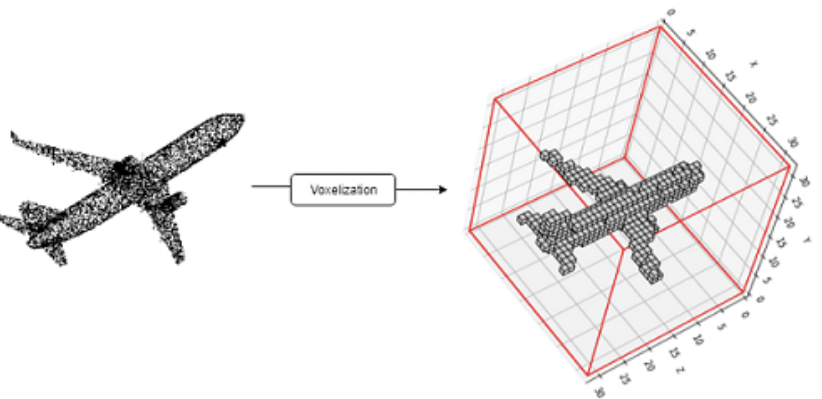
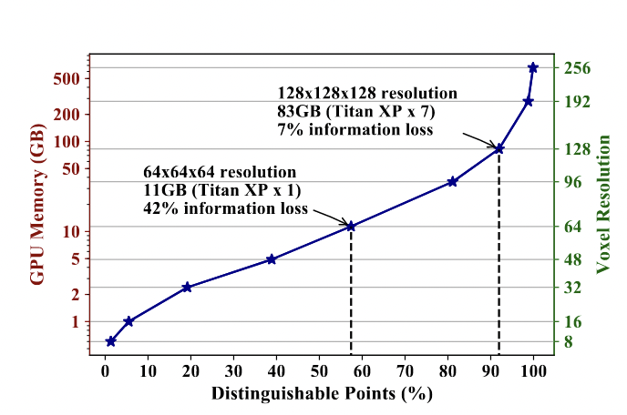

# Point Cloud Segmentation Methods

Point Cloud Segmentation is the task for grouping objects or assigning labels to every points in the point cloud. It is one of the most challenging tasks and a research topic in deep learning since point clouds are noisy, unstructured and lack connectedness property. All the methods are categorized into four categories.

## 1. Edge Based Methods

---

Edges describe the intrinsic characteristics of the boundary of any 3D object. Edge-based methods locate the points which have rapid changes in the neighborhood. Bhanu[<a href="#survey" style="color:red">1</a>] proposed three approaches for detecting the edges of a 3D object. The first approach is calculating the gradient. Let $r(i,j)$ be the range value at $(i,j)$ position, the magnitude and the direction of edge can be calculated by
    $$m(i,j:0)=\frac{r(i,j-k)+r(i,j+k)-2r(i,j)}{2k}$$
    $$m(i,j;45)=\frac{r(i-k,j+k)+r(i+k,j-k)-2r(i,j)}{2k\sqrt2}$$
    $$m(i,j;90)=\frac{r(i-k,j)+r(i+k,j)-2r(i,j)}{2k}$$
    $$m(i,j;135)=\frac{r(i-k,j-k)+r(i+k,j+k)-2r(i,j)}{2k\sqrt2}$$
     
For flat surfaces these values are zero, positive when edges are convex and negative when edges are concave. The maximum magnitude of gradient is $\max m(i,j;\theta)$ and the direction of edge is $argmax_{\theta}$ $m(i,j;\theta)$. Using threshold, points can be segmented.
    The second approach is fitting 3D lines to a set of points(i.e neighboring points) and detecting the changes in the unit direction vector from a point to the neighboring points. The third approach is a surface normal approach where changes in the normal vectors in the neighborhood of a point determine the edge point. Edge models are fast and interpretable but they are very sensitive to noise and sparse density of point clouds and lack generalization capability. Learning on incomplete point cloud structure with edge-based models does not give good accuracy. In Medical image datasets especially MRI data, the organ boundaries sometimes do not have high gradient points compared to CT data which means for every modality, we have to find new thresholds in edge-based methods.
    
## 2. Region Based Methods

---

Region-based methods use the idea of neighborhood information to group points that are similar thus finding similarly grouped 3D objects and maximizing the dissimilarity between different objects. Compared to edge-based methods, these methods are not susceptible to noise and outliers but they suffer from inaccurate border segmentation. There are two types of region-based methods.

<ol type="A">
<li><strong>Seeded-region Methods(bottom up):</strong> Seeded region segmentation is a fast, effective and very robust image segmentation method. It starts the segmentation process by choosing manually or automatically in preprocessing step, a set of seeds which can be a pixel or a set of pixels and then gradually adding neighbouring points if certain conditions satisfy regarding similarity[<a href="#survey" style="color:red">1</a>,<a href="#vsrg" style="color:red">5</a>]. The process finishes when every point belongs to a region. 
        Suppose there are N seeds chosen initially. Let $A=\{A_1,A_2,\cdots,A_N\}$ be the set of seeds. Let T be the set of pixels that are not in any $A_i$ but is adjacent to at least a point in $A_i$.
        $$T = \bigg\{x\notin \bigcup_{i=1}^{i=N} A_i|nbr(x) \cap \bigcup_{i=1}^{i=N} A_i \neq \phi \bigg\}$$
        where $nbr(x)$ is the neighbourhood points of x. At each step if $nbr(x) \cap A_i \neq \phi$, then x is added into the region if certain conditions are met. One such condition can be checking the difference between intensity value of $x$ with the average intensity value of $A_i \forall A_i \text{ such that } nbr(x) \cap A_i \neq \phi$. The region with minimum difference is assigned to the point. There are another method when greyvalues of any point is approximated by fitting a line i.e if a coordinate of any pixel/point $p$ is $(x,y)$, then greyvalue of $p$, $G(p)=b+a_1x+a_2y+\epsilon$, where $\epsilon$ is the error term. The new homogeneity condition is to find the minimum distance between average approximated greyvalue and the approximated greyvalue of $x$.
        Seeded-based segmentation is very much dependent upon the choice of seed points. Inaccurate choices often lead to under-segmentation or over-segmentation. </li>
        <li> <strong> Unseeded-region Methods(top-down):</strong> Unlike seeded-based methods, unseeded methods have a top-down approach. The segmentation starts with grouping all the points into one region. Then the difference between all the mean point values and chosen point value is calculated. If it is more than the threshold then the point is kept otherwise the point is different than the rest of the points and a new region is created and the point is added into the new region and removed from the old region. The challenges are over-segmentation and domain-knowledge which is not present in complex scenes[<a href="#survey" style="color:red">1</a>].</li>
</ol>

## 3. Attribute Based Methods

---

Attribute-based methods use the idea of clustering. The approach is to calculate attributes for points and then use a clustering algorithm to perform segmentation. The challenges in these methods are how to find a suitable attribute that contains the necessary information for segmentation and to define proper distance metrics. Some of the attributes can be normal vectors, distance, point density, or surface texture measures. It is a very robust method but performs poorly if points are large-scale and attributes are multidimensional.[<a href="#survey" style="color:red">1</a>]

## 4. Deep Learning Based Methods

---

The main challenge in point cloud segmentation is find good latent vector which can contain sufficient information for segmentation task. Deep Learning methods offers the best solution to learn good representations. Neural networks being a universal approximator can theoretically approximate the target function for segmentation. The following theorem justifies how <a href="https://en.wikipedia.org/wiki/Multilayer_perceptron">MLP</a>s can approximate the function for the segmentation task given enough neurons.

<strong>Theorem 1:</strong> Given a set of point clouds $X=\{\{x_i\}_{i=1}^{i=n},n\in \mathbb{Z}^+,x_i \in [0,1]^m\} $, let $f:X \rightarrow R$ be a continuous function with respect to hausdorff distance($d_H(\cdot,\cdot)$).$\forall \epsilon > 0, \exists \eta,$ a continuous function and a symmetric set function $g(x_1,x_2,\cdots x_n)=\gamma \circ MAX$ such that $\forall S\subset X$.
     $$\bigg|f(S)-\gamma \bigg(\underset{x_i \in S}{MAX}(\eta(x_i)) \bigg) \bigg|<\epsilon$$
     $\gamma$ is a continuous function and $MAX$ is an elementwise max operation which takes an input $k$ number of vectors and return a vector with element wise maximum. In practice $\gamma \text{ and } \eta$ are <a href="https://en.wikipedia.org/wiki/Multilayer_perceptron">MLP</a> [<a href="#pnet" style="color:red">2</a>].

     

     <strong>Proof:</strong> The hausdorff distance is defined by
    $$d_H(x,y)=\max\bigg\{\sup\limits_{x\in X}(\inf\limits_{y\in Y} d(x,y)), \sup\limits_{y\in Y}(\inf\limits_{x\in X} d(x,y))\bigg\}$$
     Since $f$ is a continuous function from $Y$ to $R$ w.r.t hausdorff distance, so by definition of continuity $\forall \epsilon > 0, \exists \delta_{\epsilon} > 0 $ such that if $S_1,S_2 \subset X$ and $d_H(S_1,S_2)<\delta_{\epsilon}$, then $|f(S_1)-f(S_2)|<\epsilon$.
     Let $K=\lceil {\frac{1}{\delta_\epsilon}}\rceil, K\in \mathbb{Z}^+$. So $[0,1]$ is evenly divided into K intervals. Let $\sigma(x)$ be defined by 
     $$\sigma(x) =\frac{\lfloor{Kx}\rfloor}{K}, x \in S$$
     So $\sigma$ maps a point to the left side of the interval it belongs to and $$|x-\frac{\lfloor{Kx}\rfloor}{K}|=\frac{Kx-\lfloor{Kx}\rfloor}{K}<1/K\leq \delta_\epsilon$$
     Let $\tilde{S}={\sigma(x)},x\in S$, then $$|f(S) - f(\tilde{S})|<\epsilon$$ Since $d_H(S,\tilde{S})\leq \delta_\epsilon.$
     Let $\eta_k(x)=e^{-d(x,[\frac{k-1}{k},\frac{k}{K}])}$ be the indicator function where $d(x,I)$ is the point to set distance $$d(x,I)=\inf\limits_{y \in I}d(x,y)$$ $d(x,I)=0$, if $x\in I$, so $\eta_k(x)=1 \text{ if } x \in [\frac{k-1}{k},\frac{k}{K}].$
     Let $\eta(x)=[\eta_1(x);\eta_2(x);\cdots;\eta_n(x)]$. Since there are K intervals we can define K functions $v_j:\mathbb{R}^n \rightarrow \mathbb{R}, \forall j=1,\cdots,K$ such that $$v_j(x_1,x_2,x_3,\cdots,x_n)=\max\{\eta_j(x_1),\cdots,\eta_j(x_n)\}$$
     So $v_j$ denotes if any points from $S$ occupy the $jth$ interval. Let $v=[v_1;v_2,\cdots,;v_n]$. So $v:R^n\rightarrow [0,1]^K$.
     Let $\tau:[0,1]^K \rightarrow X$ be defined by $$\tau(v(x_1,x_2,\cdots,x_n))=\bigg\{\frac{k-1}{K}: v_k \geq 1 \bigg\}$$
     So $\tau$ denotes the lower bound of any interval if it contains any point from $S$. In this respect, $\tau(v) \equiv \tilde{S}$. Let $range(\tau(v))=S_{\tau}, d_H(S_{\tau},S)<\frac{1}{K} \leq \delta_{\epsilon}$ $$|f(\tau(v(x_1,x_2,\cdots,x_n)))-f(S)|<\epsilon$$
     Let $\gamma:\mathbb{R}^K \rightarrow R$ be a continuous function such that $\gamma(v)=f(\tau(v))$.Now $$\gamma(v(x_1,x_2,\cdots,x_n))=\gamma (MAX)(\eta(x_1),\cdots,\eta(x_n))$$
     So $f$ can be approximated by a continuous($\gamma$) and a symmetric function($MAX$).In practice, $\gamma \text{ and } \eta$ can be approximated by <a href="https://en.wikipedia.org/wiki/Multilayer_perceptron">MLP</a>.

  
The DL methods for point cloud segmentation can be divided into following ways.

### A. Projection-Based Networks

Following the success of 2d <a href="https://en.wikipedia.org/wiki/Convolutional_neural_network">CNN</a>s, projection-based networks use the projection of 3D point clouds into 2d images from various views/angles. Then 2D CNN techniques are applied to it to learn feature representations and finally features are aggregated with multi-view information for final output [<a href="#mvc" style="color:red">6</a>,<a href="#review1" style="color:red">7</a>]. In [<a href="#tconv" style="color:red">8</a>], tangent convolutions are used. For every point, tangent planes are calculated and tangent convolutions are based on the projection of local surface geometry on the tangent plane. This gives a tangent image which is an $l\times l$ grid where 2d convolutions can be applied. Tangent images can be computed even on a large-scale point cloud with millions of points. Compared to voxel-based models, multi-view models perform better since 2D <a href="https://en.wikipedia.org/wiki/Convolutional_neural_network">CNN</a> is a well-researched area and multi-view data contain richer information than 3D voxels even after losing depth information. The main challenges in multi-view methods are the choice of projection plane and the occlusion which can affect accuracy.

### B. Voxel-Based Networks

Voxel-based methods convert the 3D point clouds into voxel-based images. Figure [<a href="#voxelization" style="color:red">1</a>] shows an example. The points which make up the point cloud are unstructured and unordered but <a href="https://en.wikipedia.org/wiki/Convolutional_neural_network">CNN</a> requires a regular grid for convolution operation. 
<figure id="voxelization">
					
 

					<figcaption class="figure-caption text-center">Figure 1: Voxelization of a point cloud (Image from [<a href="#pvcnn" style="color:red">9</a>])
					</figcaption>
				</figure>
				

				Voxelization is done in the following steps.
				<ul>
				<li> A bounding box of the point cloud is calculated which defines the entire space that is to be divided.</li>
				<li>Then the space is divided into a fixed-size grid. Each grid is called 3D cuboids.</li>
				<li>The point cloud is divided into different grids with each 3D cuboid containing several points and these 3D cuboids become voxels that represent the subset of points.</li>
				<li>Features are calculated from the subset of points inside a voxel.</li>
				</ul>
				

				Voxelization creates quantization artifacts and loses smooth boundary information. It is a computationally expensive preprocessing step and memory footprints increase cubically due to the cubical growth of voxels.  If voxel resolution is low, many points will belong to a voxel and will be represented by a single voxel so these points will not be <i> differentiable </i>. A point is <i> differentiable </i> if it exclusively occupies one voxel grid. Figure <a href="#memory" style="color:red">2</a> summarizes the memory requirements for if we want to retain higher number of differentiable points which will mean lower information loss [<a href="#pvcnn" style="color:red">9</a>]. To retain 90% of the differentiable points, GPU memory is more than 82 GB and voxel resolution is $128 \times 128 \times 128$ which is a huge computational overload.
				<figure id="memory">
					
 

					<figcaption class="figure-caption text-center">Figure 2: Voxelization and memory footprint (Image from [<a href="#pvcnn" style="color:red">9</a>]))
					</figcaption>
				</figure>
        After voxelization, 3D <a href="https://en.wikipedia.org/wiki/Convolutional_neural_network">CNN</a>s can be applied for learning features for segmentation (3d UNet). In a similar approach, <i>Point-Voxel CNN</i> [<a href="#pvcnn" style="color:red">9</a>] uses <a href="https://en.wikipedia.org/wiki/Convolutional_neural_network">CNN</a> and <a href="https://en.wikipedia.org/wiki/Multilayer_perceptron">MLP</a> bases fusion learning. It first voxelizes the point cloud and uses convolution for feature learning and then devoxelize the voxels for voxel-to-point mapping(i.e interpolation is used to create distinct features of a voxel for the points that belong to the voxel). The features of a point cloud are then aggregated with the features learned using <a href="https://en.wikipedia.org/wiki/Multilayer_perceptron">MLP</a>. Despite its remarkable advances in segmentation tasks in the medical domain in segmentation tasks, 3D CNNs have a lot of parameters and is computationally expensive. Reducing the input size causes the loss of important information. 3DCNN also requires a large number of training samples.

### C. Point-Based Networks

Point-Based Networks work on raw point cloud data. They do not require voxelization or projection. <a href="#pnet" style="color:red">PointNet</a> is a breakthrough network that takes input as raw point clouds and outputs labels for every point. It uses permutation-invariant operations like pointwise MLP and symmetric layer, Max-Pooling layer for feature aggregation layer. It achieves state-of-the-art performance on benchmark datasets. But <a href="#pnet" style="color:red">PointNet</a> lacks local dependency information and so it does not capture local information. The max-pooling layer captures the global structure and loses distinct local information. Inspired by <a href="#pnet" style="color:red">PointNet</a> many new networks are proposed to learn local structure. <a href="#pnet++" style="color:red">PointNet++</a> extends the <a href="#pnet" style="color:red">PointNet</a> architecture with an addition of local structure learning method. The local structure information passing idea follows the three basic steps (1) Sampling (2) Grouping (3) Feature Aggregation Layer (Section 3.3.1.E lists some Feature Aggregation functions) to aggregate the information from the points in the nearest neighbors. <i> Sampling </i> is choosing $M$ centroids from $N$ points in a point cloud ($N>M$). Random Sampling or Farthest Point Sampling are two such methods for sampling centroids. <i>Grouping</i> refers to sample representative points for a centroid using KNN. It takes the input (1) set of points $N\times(d+C)$, with $N$ is the number of points,$d$ coordinates and $C$ feature dimension and (2) set of centroids $N_1\times d$. It outputs $N_1\times K \times (d+C)$ with $K$ is the number of neighbors. These points are grouped in a local patch. The points in the local patches are used for creating local feature representation for centroid points. These local patches work like receptive fields. <i>Feature Aggregation Layer</i> takes the feature of the points in the receptive field and aggregate them to output $N_1\times(d+C)$. This process is repeated in a hierarchical way reducing the number of points as it goes deeper. This hierarchical structure enables the network to be able to learn local structures with an expanding receptive field. Most of the research in this field has gone into developing an effective feature aggregation layer to capture local structures. <a href="#pweb" style="color:red">PointWeb</a> creates a new module <i> Adaptive Feature Adjustment</i> to enhance the neighbor features by adding the information about the impact of features on centroid features and the relation between the points. It then combines the features and uses MLP to create new representations for centroid points. Despite their initial successes the following methods achieve higher performance due to their advanced local aggregation operators.

### D. Graph-Based Networks
A point cloud is unstructured, unordered, and
has no connectivity properties. But it can be transformed into a graph
structure by adding edges to the neighbors. Graph structures are good for
modeling correlation and dependency amidst points through edges. GNN
based networks use the idea of graph construction, local structure learning
using expanding receptive field, and global summary structure. <a href="#pgnn" style="color:red">PointGNN</a> creates a graph structure using KNN and applies pointwise MLP
on them followed by feature aggregation. It updates vertex features along
with edge features at every iteration. <a href="#sg" style="color:red">Landrieu</a> introduces super point graphs to
segment large-scale point clouds. It first creates a partition of geometrically
similar objects (i.e planes, cubes) in an unsupervised manner and applies
graph convolutions for contextual segmentation. <a href="#dgcnn" style="color:red">DGCNN</a> introduces
the Edge Convolution operation for dynamically updating the vertices and
edges thus updating the graph itself. <a href="#pgc" style="color:red">Ma</a> creates a Point Global Context
Reasoning module to capture the global contextual information from the
output of any segmentation network by creating a graph from the output
embedding vectors.

### E. Transformer and Attention-Based Networks
Transformers and attention mechanism are a major breakthrough in NLP tasks. This has lead to research in attention mechanism in 2D CNN\cite{attention}. Attention follows the following derivation.
        \begin{equation}
            y_i=\sum\limits_{x_j\in R(x_i)} \alpha(x_i,x_j) \odot \beta(x_j)
        \end{equation}
        where $\odot$ is the Hadamard product, $R(x_i)$ is the local footprint of $x_i$ (i.e a receptive field, one such example can be nearest neighbors). $\beta(x_j)$ produces a feature vector from $x_j$ that is adaptively aggregated using the vector of $\alpha(x_i,x_j)$, where $\alpha(x_i,x_j)=\gamma(\delta(x_i,x_j))$. $\delta$ combines the features of $x_i$ and $x_j$ and $\gamma$ explores the relationship between $x_i$ and $x_j$ expressively. In NLP, $\gamma,\delta \text{ and }\beta$ is known as <i>Query, Key and Value</i>. Some examples of $\delta$ function can be
        <ul>
            <li> $\delta(x_i,x_j)=f_1(x_i)+f_2(x_j)$ </li>
            <li> $\delta(x_i,x_j)=f_1(x_i)-f_2(x_j)$ </li>
            <li> $\delta(x_i,x_j)=f_1(x_i)\odot f_2(x_j)$ </li>
            <li> $\delta(x_i,x_j)=[f_1(x_i);f_2(x_j)]$ ($;$ denotes concatenation) </li>
        </ul>
        <b>In Matrix Form:</b> Let $P$ be the set of points in a point cloud ($P \in \mathbb{R)^{N\times F}}$ where F is the feature channels). $Q,K\in \mathbb{R}^{N\times C_k},V\in \mathbb{R}^{N\times C_v}$.
        \begin{equation}\nonumber
        \begin{split}
            & Q=PW_q,K=PW_k,V=PW_v\\
            & Attention(Q,K,V)=softmax\bigg(\frac{QK^T}{\sqrt{F_k}}\bigg)V
        \end{split}
        \end{equation}
        The time complexity of original attention is $O(N^2C_v)$ and space complexity $O(N^2+NC_k+NC_v)$ which quadritically increases as $N$ increases.
        Attention mechanism can be categorized into two categories. Self Attention where Query, key and value is derived from the same input meaning model uses attention scores for making better representation from a single representation. $Cross Attention$ where Value and Key comes from an input and Query comes from another input. It's used to query and learn conditional representation using the attention score of other feature vectors. In point cloud segmentation network, attention is generally used for local aggregation layer for giving adaptive weights to different features and can be used in point based or graph based networks. <a href="#pt" style="color:red">Point Transformer</a> uses Equation 4 for local feature aggregation layer after extracting neighbors. Each of the component is approximated by an MLP. Furthermore it uses encoder-decoder like structure. In each layer of the encoder, points are downsampled by a certain factor and in decoders the points are upsampled with skip connections added for preventing information leak. <a href="#3dmedpt" style="color:red">3D Medical Point Transformer</a> uses an Edge Convolution module for computing query value. It uses <i>Lambda Attention</i> layer which is $$Attention(Q,K,V)=Q(softmax(K^T)V)$$ which has $O(NC_kC_v)$ time complexity and $O(NC_k+C_kC_v+C_kC_v)$ space complexity. Although it uses cost effective attention layer, 3DMedPT can't perform large scale point cloud segmentation due to computational issues. <a href="#pat" style="color:red">Point Attention Network</a> uses a new end-to-end subsampling method for downsampling the number of points and is permutation invariant and robust to noises and outliers.

## 5. Bibliography
 <ol>
         <li>
            
Anh Nguyen, Bac Le, <a href="https://ieeexplore.ieee.org/document/6758588"><i>3D Point Cloud Segmentation - A Survey</i></a>, 2013 6th IEEE Conference on Robotics, Automation and Mechatronics (RAM), 2013, pp. 225-230.

         </li>
         <li>
            
Charles R. Qi, Hao Su, Kaichun Mo, Leonidas J. Guibas, <a href="https://openaccess.thecvf.com/content_cvpr_2017/papers/Qi_PointNet_Deep_Learning_CVPR_2017_paper.pdf"><i>PointNet: Deep Learning on Point Sets for 3D Classification and Segmentation</i></a>, 2017 IEEE Conference on Computer Vision and Pattern Recognition (CVPR), 2017, pp. 77-85.

         </li>
          <li>
            
Qingyong Hu, Bo Yang, Linhai Xie, Stefano Rosa, Yulan Guo, Zhihua Wang, A. Trigoni, A. Markham, <a href="https://openaccess.thecvf.com/content_CVPR_2020/papers/Hu_RandLA-Net_Efficient_Semantic_Segmentation_of_Large-Scale_Point_Clouds_CVPR_2020_paper.pdf"><i>RandLA-Net: Efficient Semantic Segmentation of Large-Scale Point Clouds</i></a>,  2020 IEEE/CVF Conference on Computer Vision and Pattern Recognition (CVPR).

         </li>
         <li id="gss"> 
Jiancheng Yang, Qiang Zhang, Bingbing Ni, Linguo Li, Jinxian Liu, Mengdie Zhou, Qi Tian, <a href="https://arxiv.org/abs/1904.03375"><i>Modeling Point Clouds with Self-Attention and Gumbel Subset Sampling</i></a>, 2019 IEEE/CVF Conference on Computer Vision and Pattern Recognition (CVPR) 3318-3327. 10.1109/CVPR.2019.00344. 
         </li>
         <li>
         
M. Fan.
<a href="https://www.researchgate.net/profile/Minjie-Fan-2/publication/269338276_Variants_of_Seeded_Region_Growing/links/5487cd460cf268d28f0728a2/Variants-of-Seeded-Region-Growing.pdf?origin=publication_detail">Variants of Seeded Region Growing</a>. Image Processing, IET · June 2015

         </li>
         <li>
         

         Hang Su, Subhransu Maji ,Evangelos Kalogerakis, Erik Learned-Miller.
<a href="https://ieeexplore.ieee.org/document/7410471">Multi-view Convolutional Neural Networks for 3D Shape Recognition</a>. 2015 IEEE International Conference on Computer Vision (ICCV), 2015, pp. 945-953
         

         </li>
         <li>
         
Saifullahi Aminu Bello , Shangshu Yu, Cheng Wang.
<a href="https://arxiv.org/pdf/2001.06280.pdf">Review: deep learning on 3D point clouds</a>. Remote Sensing 12, No. 11:1729.
         

         </li>
         <li>
         

         Maxim Tatarchenko, Jaesik Park, Vladlen Koltun, Qian-Yi Zhou.
<a href="https://arxiv.org/pdf/1807.02443.pdf">Tangent Convolutions for Dense Prediction in 3D</a>. 2018 IEEE/CVF Conference on Computer Vision and Pattern Recognition (CVPR)
         

         </li>
         <li>
         

         Zhijian Liu, Haotian Tang, Yujun Lin, Song Han.
<a href="https://proceedings.neurips.cc/paper/2019/file/5737034557ef5b8c02c0e46513b98f90-Paper.pdf">Point-Voxel CNN for Efficient 3D Deep Learning</a>. Proceedings of the 33rd International Conference on Neural Information Processing Systems 2019.
         

         </li>
         <li>
         

         Charles R. Qi, Li (Eric) Yi, Hao Su, Leonidas J. Guibas 
<a href="https://dl.acm.org/doi/10.5555/3295222.3295263">PointNet++: Deep Hierarchical Feature Learning on Point Sets in a Metric Space</a>. In Proceedings of the 31st International Conference on Neural Information Processing Systems (NIPS'17). Curran Associates Inc., Red Hook, NY, USA, 5105–5114.
         

         </li>
         <li>
         

         H. Zhao, L. Jiang, C. -W. Fu and J. Jia
<a href="https://ieeexplore.ieee.org/document/8954075">PointWeb: Enhancing Local Neighborhood Features for Point Cloud Processing</a>. 2019 IEEE/CVF Conference on Computer Vision and Pattern Recognition (CVPR), 2019, pp. 5560-5568, doi: 10.1109/CVPR.2019.00571.
         

         </li>
         <li>
         

         Shi, Weijing and Rajkumar, Ragunathan (Raj)
<a href="https://arxiv.org/pdf/2003.01251.pdf">Point-GNN: Graph Neural Network for 3D Object Detection in a Point Cloud</a>.The IEEE Conference on Computer Vision and Pattern Recognition (CVPR).
         

         </li>
         <li>
         

         Landrieu, Loic and Simonovsky, Martin
<a href="https://ieeexplore.ieee.org/document/8578577">Large-Scale Point Cloud Semantic Segmentation with Superpoint Graphs</a>.2018 IEEE/CVF Conference on Computer Vision and Pattern Recognition.
         

         </li>
          <li>
         

         Wang, Yue and Sun, Yongbin and Liu, Ziwei and Sarma, Sanjay E. and Bronstein, Michael M. and Solomon, Justin M.
<a href="https://arxiv.org/abs/1801.07829">Dynamic Graph CNN for Learning on Point Clouds</a>. ACM Transactions on Graphics (TOG).
         

         </li>
             <li>
         

         Ma, Yanni and Guo, Yulan and Liu, Hao and Lei, Yinjie and Wen, Gongjian
<a href="https://ieeexplore.ieee.org/document/9093411">Global Context Reasoning for Semantic Segmentation of 3D Point Clouds.</a>. 2020 IEEE Winter Conference on Applications of Computer Vision (WACV).
         

         </li>
         <li>
         

         Zhao, Hengshuang and Jiang, Li and Jia, Jiaya and Torr, Philip HS and Koltun, Vladlen
<a href="https://github.com/POSTECH-CVLab/point-transformer">Point transformer.</a>. Proceedings of the IEEE/CVF International Conference on Computer Vision.
         

         </li>
         <li>
         

         Jianhui Yu, Chaoyi Zhang, Heng Wang, Dingxin Zhang, Yang Song, Tiange Xiang, Dongnan Liu, Weidong Cai
<a href="https://arxiv.org/abs/2112.04863">3D Medical Point Transformer: Introducing Convolution to Attention Networks for Medical Point Cloud Analysis.</a>. arXiv - CS - Computer Vision and Pattern Recognition  (IF),  Pub Date : 2021-12-09, DOI: arxiv-2112.04863.
         

         </li>
         <li>
         

         Mingtao Feng, Liang Zhang, Xuefei Lin, Syed Zulqarnain Gilani, Ajmal Mian
<a href="https://arxiv.org/abs/1909.12663">Point Attention Network for Semantic Segmentation of 3D Point Clouds.</a>.
         

         </li>
      </ol>
