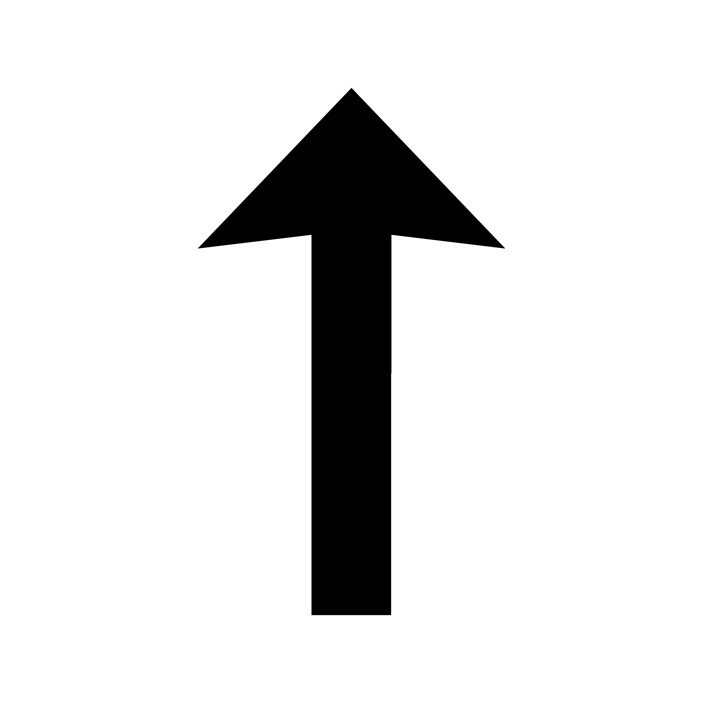

# Introduction

Data Collection is a major step in every Machine Learning projects. The quality and quantity of data alone can greatly impact the results of the model. AutoAnnotator is an open-source automatic image annotator created using the Swift and Python. It's an updated version of AutoLabelMe, the GUI I wrote using Tkinter library in Python for my Internship at Hubert Curien Laboratoire. 

It matches the template provided by the user in an image and find same objects associating a bounding box and label for every object. AutoAnnotator uses Normalized Cross-Correlation to check whether two templates are similar. It is designed keeping in mind with the necessity of creating dataset for object detection purposes.

<video width="768" height="480" autoplay muted controls loop>
  <source src="assets/matchexamples.mp4" type="video/mp4">
  <p>
    Your browser doesn't support HTML video. Here is a
    <a href="matchexamples.mp4">link to the video</a> instead.
  </p>
</video>
<div> &nbsp; </div>
<div> &nbsp; </div>
<div> &nbsp; </div>
<div> &nbsp; </div>
<div align="center"> 
  <a href="assets/AutoAnnotator.zip"><b style="color:rgba(200, 113, 210,1);">Download</b></a> |
  <a href="#installation"><b style="color:rgba(0, 118, 189,1);">Installation</b></a> |
  <a href="#tutorial"><b style="color:rgba(100, 113, 210,1);">Tutorial</b></a> |
  <a href="#examples"><b style="color:rgba(200, 113, 100,1);">Examples</b></a> |
  <a href="#changelog"><b style="color:rgba(14, 145, 94,1);">Change Log</b></a>
</div>

## Installation

Currently only for Macos, AutoAnnotator is released.

### Prerequisites
1. MacOS
2. [Anaconda Distribution](https://www.anaconda.com/products/distribution)
3. Python

### Python Library Requirements

<b style="color:rgba(50, 125, 240,1);">1. Numpy</b>
 
```console
user@Mac ~ % conda install numpy 
```
or 
```console
user@Mac ~ % pip install numpy
```

<b style="color:rgba(50, 125, 240,1);">2. Pandas</b>
 
```console
user@Mac ~ % conda install pandas 
```

<b style="color:rgba(50, 125, 240,1);">3. Opencv</b>
 
```console
user@Mac ~ % conda install -c conda-forge opencv 
```

or 

```console
user@Mac ~ % pip install opencv-python
```

<b style="color:rgba(50, 125, 240,1);">4. PIL</b>

```console
user@Mac ~ % pip install Pillow
```

<b style="color:rgba(200, 0, 0,1);">Installtion of the python libraries is necessary for the app to run effectively. If you don't have it installed or if the selected python environment in the app don't have it installed, the app will install it automatically. This may delay results. </b>
  
## Tutorial
The first two steps are very important. These two steps are to be done only once. 
<div align="left">
  <a href="#change-python-environment"><b style="color:rgba(200, 0, 0,1);">1. Change Python Enviroment (Important Step) </b></a>
  </br>
  <a href="#path-for-python-scripts"><b style="color:rgba(200, 0, 0,1);">2. Path for Python Scripts (Important Step) </b></a>
  </br>
  <a href="#add-new-images"><b>3. Add New Images</b></a>
  </br>
  <a href="#draw-rectangle"><b>4. Draw Rectangle</b></a>
  </br>
  <a href="#move-rectangle"><b>5. Move Rectangle</b></a>
  </br>
  <a href="#resize-rectangle"><b>6. Resize Rectangle</b></a>
  </br>
  <a href="#match-rectangles"><b>7. Match Rectangles</b></a>
</div>

### Change Python Environment 
<a href="#tutorial"></a>

AutoAnnotator is written in Swift and Python and it only requires that Python is installed in your machine. You don't need to install Swift. The libraries mentioned [here](#python-library-requirements) are necessary for automatic box generation purposes. When you will first open AutoAnnotator, it will choose the default Python Environment which mayn't have those libraries installed. 

Your system may have multiples python environments, this step will make sure you load the correct environment in the app.

```console
Click on 'Settings'
```


When the popover appears check the python path. The path may be like this
```console
/opt/homebrew/bin/python3
```
If you have installed the [libraries](#python-library-requirements) in any anaconda enviroment then change the path to the anaconda python environment.

```console
Click on 'Change Path'
```


The anaconda environment paths look like these. 

```console
~/anaconda/bin/python3
~/anaconda/envs/your-environment-name/bin/python3
~/anaconda/envs/your-environment-name/bin/python
```

<b style="color:rgba(200, 0, 0,1);"> *Once this step is complete, check the path and restart the app for the changes to take effect. This step is to be done only once when you first open the app.</b>


### Path for Python Scripts
<a href="#tutorial"></a>

Some Python Scripts are provided with the installation file. You need to load the scripts in <code> Settings/Load Scripts</code> and choose the location where you have unzipped the downloaded file.


<b style="color:rgba(200, 0, 0,1);"> *No need to restart after this step. This step is to be done only once when you open the app for the first time.</b>

### Add New Images
<a href="#tutorial"></a>

To add one or multiple images, follow these steps
```console
Click on the + button in the middle or 'New Image' button on the sidebar.

Add one or multiple images
```


### Go to Next Image
<a href="#tutorial"></a>


```console
Click on the 'next' and 'previous' button to navigate through images.
```


```console
To move to your desired image, 
click on the current image name tab and 
a popover will appear where names of every open images are available. 
Click on the image name you want to load.
```

<video width="768" height="480" autoplay muted controls loop>
  <source src="assets/image_name_tab.mp4" type="video/mp4">
  <p>
    Your browser doesn't support HTML video. Here is a
    <a href="matchexamples.mp4">link to the video</a> instead.
  </p>
</video>

### Draw Rectangle
<a href="#tutorial"></a>


```console
Click on 'Draw Rectangles' on the sidebar and start drawing on the image.
```


<b style="color:rgba(200, 100, 0,1);"> When drawing mode is enabled, you can't move the image. To move the image, click on 'Move image'.</b>

### Move Rectangle
<a href="#tutorial"></a>

Following video demonstrates how to change the box position.

<video width="768" height="480" autoplay muted controls loop>
  <source src="assets/box_manipulation.mp4" type="video/mp4">
  <p>
    Your browser doesn't support HTML video. Here is a
    <a href="matchexamples.mp4">link to the video</a> instead.
  </p>
</video>

### Resize Rectangle
<a href="#tutorial"></a>

```console
To resize an image click on the red circle of the box 
and drag it to increase or decrease the size of the box.
```
<video width="768" height="480" autoplay muted controls loop>
  <source src="assets/resize_box.mp4" type="video/mp4">
  <p>
    Your browser doesn't support HTML video. Here is a
    <a href="matchexamples.mp4">link to the video</a> instead.
  </p>
</video>

### Match Rectangles

## Examples
  
