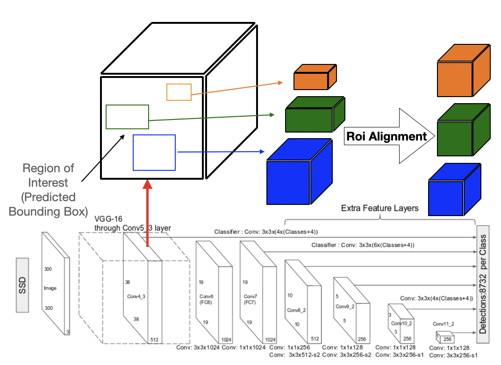

A Detector-Encoder Autoencoder, has two parts (Figure 1) - (1) the detection part in the front,
$\Phi(F_{d}(x))$, where $F_{d}$ corresponds to an encoding function performing RoI detection
(a Detector-Encoder dedicated to representation learning in the scope of object detection,
see Figure 2 and where $\Phi$ corresponds to a RoI Pooling transformation (Figure 4) (2)
the reconstruction part, $F_{r}(\phi)$, where $\phi=\Phi(F_{d}(x))$), a Decoder responsible for
image reconstruction.

## 1. Detection Part

	In AutoEncoders, the encoder part encodes any input image from which the decoder part
	reconstructs
	the image.
	DEA is designed to reproduce the detected objects.
	Conventional AutoEncoders designed to perform well copy-and-paste of inputs, can generalize too
	much
	in some abnormal cases.
	To address this issue, we suggest to replace the encoder with a Single Shot Multibox Detector
	(SSD)[1] using the following feature maps for the purpose of detection with backbone classifier
	VGG-16 (Figure 2):

<figure>
	
	<figcaption>Figure 2: SSD Architecture [1]</figcaption>
</figure>
<ui>
	<li> Conv4_3: Size $38\times 38\times 512$ </li>
	<li> Conv7: Size $19\times 19\times 1024$ </li>
	<li> Conv8_2: Size $10\times 10\times 512$ </li>
	<li> Conv9_2: Size $5\times 5\times 256$ </li>
	<li> Conv10_2: Size $3\times 3\times 256$ </li>
	<li> Conv11_2: Size $1\times 1\times 256$ </li>
</ui>

	To optimize detector SSD, it is suggested to use an Intersection over Union (IoU) loss in
	replacement of $l_{1}$ loss,
	namely a <a href="https://arxiv.org/abs/1902.09630">Generalized IOU</a> [2], <a
		href="https://arxiv.org/abs/1911.08287">Distance-IoU</a> [3] and <a
		href="https://arxiv.org/abs/2101.08158">Efficient IOU </a> [4].

The feature maps encode the characteristics of the objects of the dictionary.
	For each of the feature maps, SSD considers 4 or 6 default boxes per cell
	(Total cell=$(38\times 38 \times 4)+(19\times
	19\times6)+(10\times10\times6)+(5\times5\times6)+(3\times3\times4)+(1\times1\times4)=8732$).
	The final output of SSD for each of the default boxes are: (1) its offset $(\delta x,\delta
	y,\delta
	w,\delta h)$
	(2) a probability vector $(p_{0},p_{1},\cdots,p_{n})$ where $p_{i}$ is the probability that the
	box
	contains an object of the $i\mathit{th}$ class.
	Class $i$ for all $i \in\{1,\cdots,n\}$, corresponds to the $i\mathit{th}$ object in the
	training
	dataset
	whereas class $0$ refers to the image background.
	A Region of Interest (RoI) is determined from the final predicted box by maximizing the
	probability values, which provides a confidence value with respect to the fact that it contains
	a
	certain object. The corresponding features are accessible by checking the
	corresponding index (Figure 4) and this gives us the information of which feature maps
	the RoI is from. RoIs are like the objects, of different sizes and aspect ratios. By adding some
	layers devoted to RoI resizing after SSD, RoIs are ready to be properly processed by the
	reconstruction part. 

	<strong>1) Bounding Box Regression: </strong>Bounding box regression is one of the most
	important
	components in object detection tasks.
	In conventional SSD, a $l_{n}$ norm is used during training to evaluate the
	performance
	of the detector with the IoU (Intersection over Union) metric: $IoU=\frac{|B_{G}\cap
	B_{P}|}{|B_{G}
	\cup B_{P}|}$
	where $B_{g}$ and $B_{d}$
	are the ground and predicted bounding boxes, respectively.
	However there is no correlation between minimizing $l_{n}$ norm and improving the
	loss associated to the IoU metric, $L_{IoU}=1-IoU(B_{g},B_{d})$.

<figure>
	
	<figcaption class="figure-caption text-center">Figure 3: Three cases where the $l_{2}$-norm
		distance
		between the
		representations of two rectangular bounding boxes, each given by the concatenation of the
		coordinates of
		two opposite corners, has the same value but IoU and GIoU metrics have very different values
		[2]
	</figcaption>
</figure>

	In Figure 3, the predicted bounding box (black rectangle) and ground truth box
	(green rectangle) are each represented by their top-left and bottom-right corners
	(pointed by arrows), and whose the Cartesian coordinates are denoted as $(x_{1} , y_{1} , x_{2}
	,
	y_{2})$
	and $(x_{1}' , y_{1}' , x_{2}' , y_{2}')$, respectively. For simplicity, let us assume that the
	distance,
	e.g. $l_{2}-norm$, between one of the corners of two boxes is fixed. Now, if the second corner
	lies
	on a
	circle with fixed radius centered on the ground truth box, then the $l_{2}$ loss between the
	ground truth box and the predicted bounding box is the same although their IoU values can be
	different depending upon the positions of top-right and bottom-left corners. So, using
	IOU-loss should be the best option since a bad detector will impact negatively in the
	reconstruction
	part.
	However IoU has two major issues as a metric, following from its definition.
	If two boxes do not overlap, then their IoU is zero, which does not give any indication
	whether they are close or far. In addition, in case of non-overlapping boxes, since their
	IOU is zero, the gradient is also zero, and loss $L_{IoU}$ cannot be optimized.
	A variant of this loss was suggested to address the weaknesses of the IoU metric:
	the Generalized IoU loss <a href="https://arxiv.org/abs/1902.09630">Generalized IOU</a> ,
	$L_{GIoU}=1-GIoU$ given by the metric defined by $GIoU=IoU-\frac{|C\setminus (B_{g}\cup
	B_{P})|}{|B_{p}|}$
	where $C$ is the convex hull of the union of bounding boxes $B_{g}, B_{P}$. Computing efficient,
	approximate versions were later proposed in <a
		href="https://arxiv.org/abs/1911.08287">Distance-IoU</a>:
	<ul>
		<li>
			The Distance IOU loss defined as $L_{DIoU}=1-DIoU$ where
			$$DIoU=IoU-\frac{\rho^{2}(b_{g},b_{p})}{c_C^{2}}$$, $\rho$
			is the euclidean distance, and $c_C$ is the length of the diagonal of convex hull $C$,
		</li>
		<li>
			The Efficient IOU loss <a href="https://arxiv.org/abs/2101.08158">Efficient IOU </a>
			defined
			as $L_{EIoU}=1-EIoU$
			where $$EIoU=IoU-\frac{\rho^{2}(b_{g},b_{p})}{c^{2}}
			-\frac{\rho^{2}(w_{g},w_{p})}{c_{w}^{2}}-\frac{\rho^{2}(h_{g},h_{p})}{c_{h}^{2}},
			\rho$$ is the euclidean distance, and ($b,w,h$ defines a box centered in point
			$\mathbf{b}$
			having
			width $w$ and height $h$, its diagonal length being denoted as $c$).
		</li>
	</ul>

<figure>
	
	<figcaption class="figure-caption text-center">Figure 4: RoI Alignment step in DEA architecture.
	</figcaption>
</figure>

	<strong>2) RoI Alignment:</strong>
	We used RoIAlign, first proposed in , which allows the extraction of a $k\times k$ RoI where $k$
	is
	a predefined integer value, from feature maps. For any $N\times N$ RoI, RoIAlign divides the
	feature
	maps into $k^2$, $\frac{N}{k} \times \frac{N}{k}$ regions, named RoI bins, in each of which is
	computed a single value: the maximum or the average of the values at four points determined at
	the
	end by a linear interpolation.

## 2. Reconstruction Part

	We constructed the Decoder with three
	fully connected linear layers. The feature maps
	obtained from xIoU-SSD are first transformed
	into $1 \times 1 \times 1024$ using Average Pooling
	with kernel $(5,5)$. Each of the transformed feature
	maps are flattened and fed into the linear layers
	which are as described below (See Fig. 1):
	<ol>
		<li>Layer 1: Input 1024 $\rightarrow$ Output 2048 (Activation Function: Relu).</li>
		<li>Layer 2: Input 2048 $\rightarrow$ Output 4096 (Activation Function: Relu).
		</li>
		<li>
			Layer 2: Input 2048 $\rightarrow$ Output 4096 (Activation Function: Relu).
		</li>
		<li>
			Layer 3: Input 4096 $\rightarrow$ Output 16384 (Activation Function: Sigmoid)
		</li>
	</ol>
	The output, any reconstructed object, is then reshaped into a $128 \times 128 \times 1$ image.

## 3. Bibliography
<ol>
	<li>
		
Wei Liu, Dragomir Anguelov, Dumitru Erhan, Christian Szegedy, Scott Reed, Cheng-Yang Fu,
			Alexander C. Berg. 

		<a href="https://arxiv.org/abs/1512.02325">SSD: Singe Shot Detector.</a>
	</li>
	<li>
		
Hamid Rezatofighi, Nathan Tsoi, JunYoung Gwak, Amir Sadeghian, Ian Reid, Silvio Savarese.
		

		<a href="https://arxiv.org/abs/1902.09630">Generalized Intersection over Union: A Metric and
			A
			Loss for Bounding Box Regression.</a>
	</li>
	<li>
		
Zheng Z., et al

		<a href="https://arxiv.org/abs/1911.08287">Distance-IoU Loss: Faster and Better Learning for
			Bounding Box Regression</a>
	</li>
	<li>
		
Zhang Y., et al

		<a href="https://arxiv.org/abs/2101.08158">Focal and Efficient IOU Loss for Accurate
			Bounding
			Box Regression</a>
	</li>
	<li>
		
He. k, et al

		<a href="https://arxiv.org/pdf/1703.06870.pdf">Mask RCNN</a>
	</li>
</ol>
